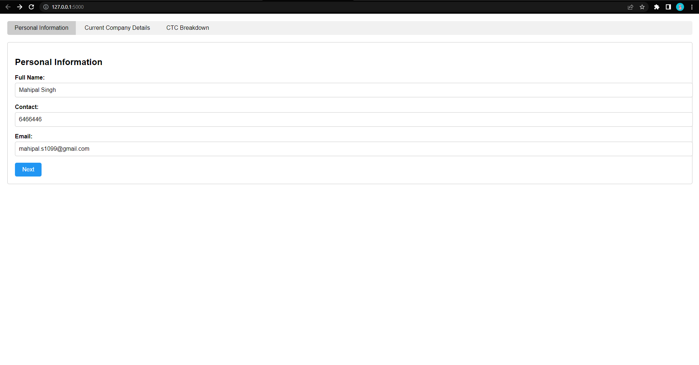
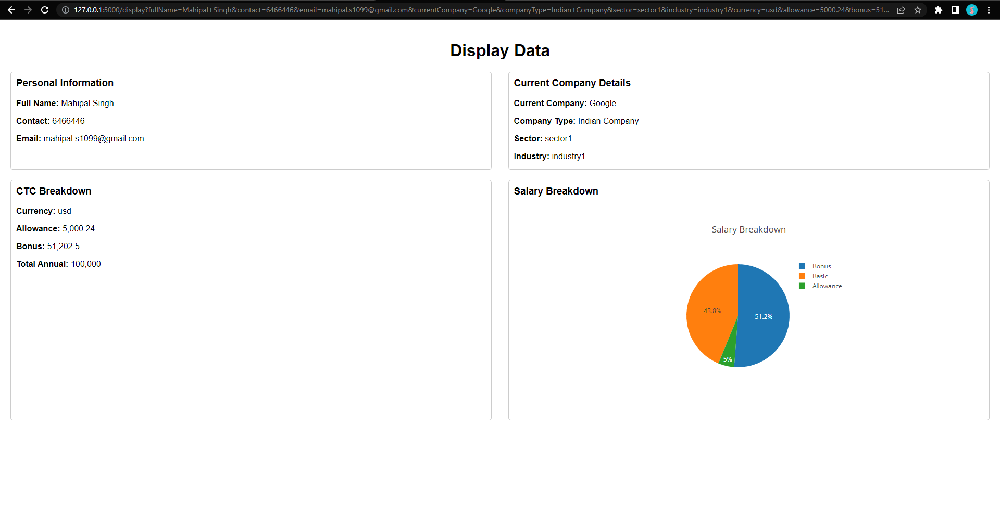

# Simple HTML Forms x Display with Flask

This project demonstrates the use of HTML forms for collecting user input and displaying the entered data on a separate page. It also includes a salary breakdown displayed in the form of a pie chart. The web application is built using the Flask framework.

## Project Structure

The project consists of the following files:

- `index.html`: The main HTML file that contains the form for collecting user input.
- `display.html`: The HTML file that displays the entered data and salary breakdown.
- `app.py`: Python script for handling form submission and generating an Excel file.

## Python Setup and Dependencies Installation
1. Open a terminal or command prompt.
2. Navigate to the project directory.
3. Make sure you have Python 3 installed on your system.
4. Install the required Python packages by running the following command:
5. Installing Dependencies
 
    ```pip install flask pandas openpyxl ```

    or 
    
    ```pip install -r requirements.txt ```

## Running the Application

1. Start the Flask development server by running the following command:
    
    ```pip install app.py ```
2. Open a web browser and go to `http://localhost:5000`.
3. Fill in the required information in the form fields and submit the form.
4. You will be redirected to the `display.html` page, where the entered data will be displayed along with the salary breakdown pie chart.
5. The submitted data will also be saved to an Excel file named `form_data.xlsx` in the project directory.

## Dependencies

- [Flask](https://flask.palletsprojects.com/) library is used for building the web application.
- [Pandas](https://pandas.pydata.org/) library is used for data manipulation and saving to Excel.
- [openpyxl](https://openpyxl.readthedocs.io/) library is used for Excel file handling.
- [Plotly](https://plotly.com/javascript/) library is used for creating the pie chart. The `plotly-latest.min.js` file is included in the project.

## Screenshots




## Credits

This project is created by Mahipal Singh. Feel free to modify and use it according to your needs.